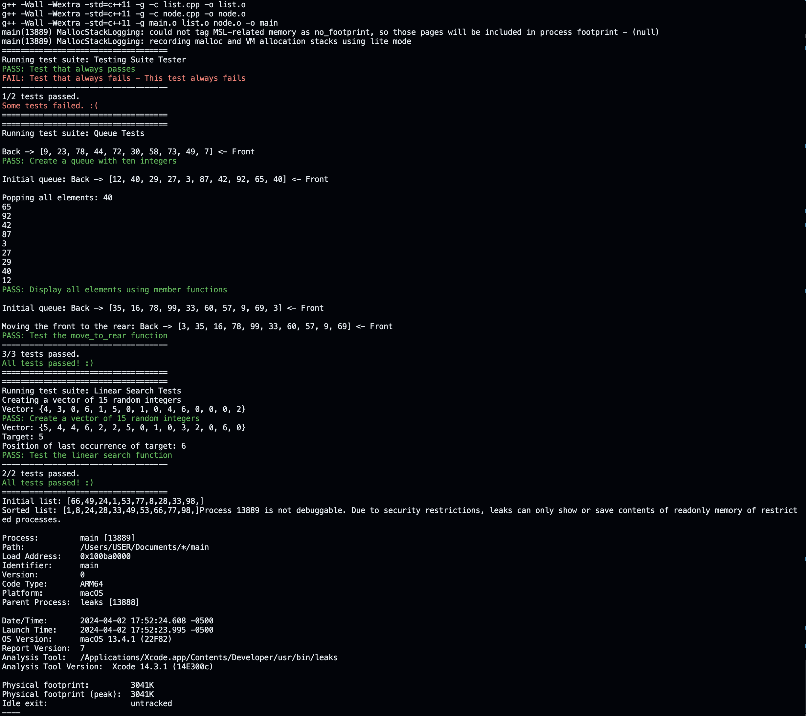

# Data Structures Assignment 3

My submission for the third assignment of the Data Structures course.



## Setup

```bash
# Clone the repository
git clone https://github.com/spigelli/Data-Structures-Assignment-3

# Change to the project directory
cd Data-Structures-Assignment-2

# Compile and run the program
make && ./main

# Clean up the project directory after running
make clean
```

## Usage

This repo simply indicates the implimentation of a Singly Linked List and a Stack using a Vector.

Check the `main.cpp` file for the unit tests and implementation details.
