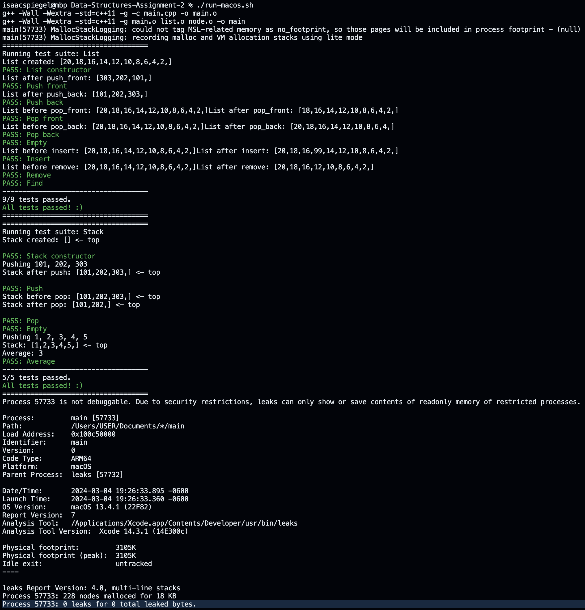

# Data Structures Assignment 2

My submission for the second assignment of the Data Structures course.



## Setup

```bash
# Clone the repository
git clone https://github.com/spigelli/Data-Structures-Assignment-1

# Change to the project directory
cd Data-Structures-Assignment-2

# Compile and run the program
make && ./main

# Clean up the project directory after running
make clean
```

## Usage

This repo simply indicates the implimentation of a Singly Linked List and a Stack using a Vector.

Check the `main.cpp` file for the unit tests and implementation details.

## Assignment Reference

### Total Points: 25

#### Q1. (15 points)

**Objective:** Build a `Single_Linked_List` class.

**Requirements:** Your class should have the data members:

- `head`
- `tail`
- `num_items`

**Write the following member functions**, which perform the same operations as the corresponding functions in the standard list class:

- `push_front`
- `push_back`
- `pop_front`
- `pop_back`
- `front`, `back`
- `empty`
- `void insert(size_t index, const Item_Type& item)`: Insert item at position index (starting at 0). Insert at the end if index is beyond the end of the list.
- `bool remove(size_t index)`: Remove the item at position index. Return true if successful; return false if index is beyond the end of the list.
- `size_t find(const Item_Type& item)`: Return the position of the first occurrence of item if it is found. Return the size of the list if it is not found.

#### Q2 (10 points)

**Objective:** Write a C++ program to implement a stack of integers using a vector with push and pop operations.

**Perform the following operations:**

1. Create a stack object.
2. Check the stack is empty or not.
3. Insert some integer values onto the stack.
4. Remove an element from the stack.
5. Find the Top of the stack.
6. Find average value of the stack elements.

#### Submission guidelines

1. You should have a header file and .cpp file. The header file should provide the function declaration and .cpp file should have implementation details.
2. All the functionality of the program should be implemented as functions and methods.
3. The code should be well commented.
4. Create a report (readme file) that contains instruction on how to run the code and screen shots of the outputs.
5. Upload your report and code files to GitHub.
6. Submit the GitHub link on Canvas by the due date.
